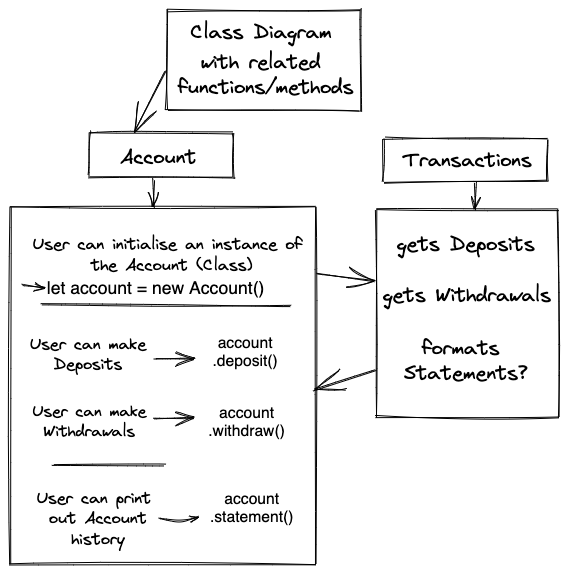

# Bank Tech Test in Javascript

`The project - to build a simple working banking app in Javascript that can run in the Node REPL, based on the Makers Bank Tech Test challenge`

---

https://github.com/makersacademy/course/blob/main/individual_challenges/bank_tech_test.md

---

`Built using my own notes, Makers Academy course material, research disseminated from Google, specific websites providing suitable advice on methodology & syntax such as Stack Overflow, MDN (Mozilla Developer's Network), W3Schools and more, looking at other bank tech test examples, relevant coding tutorial video examples from YouTube and more.`

---

# Priorities of my first (hopefully) completed Bank Tech Test

`- Priorities of this Bank Tech Test is to follow a rigorous, incremental methodology so I understand how each stage of setting-up & building a Javascript app works that performs a banking operation.`

`- I intend on setting-up using npm to install the dependencies, Jest for testing & coverage, ESLint for linting and will add other requirements to the README as I progress.`

`- I will build the app based on a set of user stories to establish the app requirements & extrapolate classes & the functions required from those user stories.`

`- I will be using step-by-step TDD (Test Driven Development) using Jest, OOP (Object Orientated Principles) & seperation of responsibilities, as much as is possible within a project of this small scale, using SRP (Separation of Responsibilities).`

`- I also intend to use this opportunity to learn more about test mocking in Jest so I can test certain functions which return a different value each time, such as dates (testing behaviour that can be predicted, from a function that usually behaves 'randomly') - this is due to a date/time having to be returned for each transaction.`

`- I will keep in mind to cover edge-cases later in the project, which will give a better interactive user experience. Edge cases could include making sure the code gives the user notice that they do not have sufficient funds in their account or the data they're entering is not an integer.`

---

# Technologies Used:

Jest - for Testing and Coverage\
ESLint - for Linting\
Excalidraw - for Class Diagram Modelling

---

### User Stories

```
#1
As a user
So that I can save money in a bank account
I want to be able to make deposits

#2
As a user
So that I can take money I've saved from my account
I want to be able to make withdrawals

#3
As a user
So that I can see a history of my account transactions
I want to be able to print a statement
```

---

# Class Model Diagram



---
